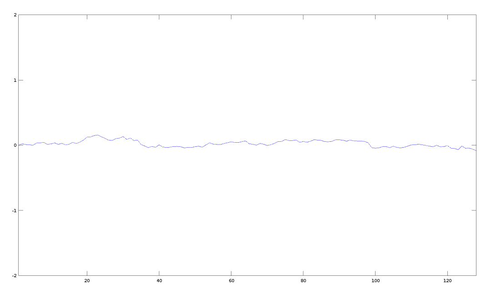
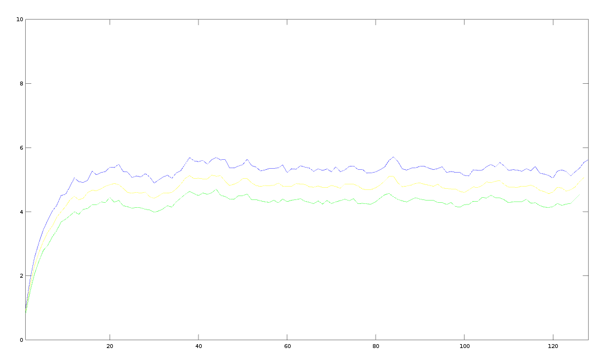

# Práctica 1.
# Variables conjuntamente Gaussianas.  
# Procesos Aleatorios.

## 1. Caracterización de variables conjuntamente Gaussianas.

En el fichero GaussDim8 hay 1000 realizaciones de una variable gaussiana de dimensión 8. Hay que, a partir de estas 1000 realizaciones, hallar el vector de medias **m** y la matriz de convarianzas **K** usando un script en Matlab.  
 Primeramente, debemos abrir el archivo con las 1000 realizaciones en Matlab. Usamos los comandos:  

    f1 = fopen('GaussDim8','r');  
    x = fread(f1,[8,1000],'single');   

Pasando a calcular el vector de medias **m**, ha de ser con una columna y ocho filas, cada una con las ocho esperanzas. Lo hacemos con dos bucles **for** anidados, de manera que para las 1000 repeticiones, pasemos por los 8 valores que conforman cada fila:

    mx = zeros(8,1);  
      for c = 1:1000;  
        for i = 1:8;    
          mx(i,1) = mx(i,1) + x(i,c);  
        end;  
      end;  
    mx = mx / 1000;

Así, el resultado obtenido es el siguiente:

    -0.0430824
    0.0067655
    0.0238114
    0.0477655
    0.0400983
    0.0200959
    0.0110923
    0.0106682

Como se ve, todos los resultados son muy cercanos a 0.

Por otro lado, matriz de convarianzas **K** es una matriz simétrica de orden 8, cuya diagonal principal consta de las varianzas de $x_1, x_2... x_n$, y que en el resto de la matriz tiene las covarianzas entre $x_1$ y $x_n$. El proceso para contruirla es muy parecido al del vector de medias: lo hacemos con tres bucles **for** anidados, de manera que para las 1000 repeticiones, pasemos por los 8 valores que conforman cada fila en dos ocasiones:

    kx = zeros(8,8);
      for c = 1:1000;
        for i = 1:8;
          for j = 1:8;
            kx(i,j) = kx(i,j) + (x(i,c) - mx(i,1)) * (x(j,c) - mx(j,1));
          end
        end
      end
    kx = kx / 1000;

El último siempre paso es dividir el vector y la matriz entre 1000 para que sean las medias y covarianzas de verdad, ya que si no, saldrían en otra escala mucho mayor.

El resultado es:

    0.88928   0.74759   0.71900   0.65484   0.60645   0.54391   0.43669   0.43750
    0.74759   1.68778   1.56303   1.45444   1.30779   1.16410   0.98636   0.95857
    0.71900   1.56303   2.49548   2.27393   1.98672   1.79347   1.55723   1.50076
    0.65484   1.45444   2.27393   3.05335   2.70121   2.47332   2.18786   2.04959
    0.60645   1.30779   1.98672   2.70121   3.44113   3.11995   2.83027   2.63051
    0.54391   1.16410   1.79347   2.47332   3.11995   3.89022   3.52182   3.20128
    0.43669   0.98636   1.55723   2.18786   2.83027   3.52182   4.19738   3.81722
    0.43750   0.95857   1.50076   2.04959   2.63051   3.20128   3.81722   4.39990  

Por último, para evitar que haya problemas con Matlab, cerramos el fichero al final del script:

    fclose(f1);

Si analizamos la matriz de covarianzas, se puede ver que no es simétrica, es decir, que la covarianza entre dos elementos diferentes no es nula. De aquí sacamos la conclusión de que las variables **no son independientes**.

Dado este hecho, sabemos que hay una transformación lineal $Y=AX$ tal que $Y$ sigue siendo una variable aleatoria Gaussiana, solo que ahora todas sus variables son independientes entre sí. Hemos de hallar esta matriz para poder trabajar con una matriz diagonal y con variables independientes entre sí, lo cual es mucho más cómodo.

Esto se hace con la función _eig_ de Matlab. Esta función nos devuelve dos matrices:

* Una $B$ que contiene los **autovectores** de la matriz $A$ introducida.

* Una $D$ que es diagonal y contiene los **autovalores** de $A$. De esta manera, y usando el álgebra de apoyo, llegamos a la conclusión de que $B^{T}KB=D$.  

El código queda:

    [B,D]=eig(kx);
    y=(B')* x;
    my=zeros(8,1);
    for c=1:1000;
      for i=1:8;
        my(i,1)=my(i,1)+y(i,c);
      end
    end
    my=my/1000;

    ky=zeros(8,8);
    for c=1:1000;
      for i=1:8;
        for j=1:8;
          ky(i,j)=ky(i,j)+((y(i,c)-my(i,1))* (y(j,c)-my(j,1)));
        end
      end
    end
    ky=ky/1000;

El proceso es el mismo que hemos seguido en la parte de arriba, solo que ahora trabajamos con la variable $y$ en vez de con la variable $x$. Ahora la matriz de convarianzas es diagonal:

    0.293  0.000  0.000  0.000  0.000  0.000  0.000  0.000
    0.000  0.325  0.000  0.000  0.000  0.000  0.000  0.000
    0.000  0.000  0.388  0.000  0.000  0.000  0.000  0.000
    0.000  0.000  0.000  0.508  0.000  0.000  0.000  0.000
    0.000  0.000  0.000  0.000  0.752  0.000  0.000  0.000
    0.000  0.000  0.000  0.000  0.000  1.200  0.000  0.000
    0.000  0.000  0.000  0.000  0.000  0.000  3.380  0.000
    0.000  0.000  0.000  0.000  0.000  0.000  0.000  10.71

Como se esperaba, ahora todas las convarianzas son 0 porque las variables son independientes.

## 2. Procesos Aleatorios.

En el fichero signal1 hay 2000 realizaciones de un muestreo realizado en 128 instantes de tiempo diferentes de un proceso gaussiano discreto en el tiempo. Hay que hallar la media $m_x(n)$ y su autocorrelación $R_x(n1, n2)$ usando un script en Matlab de manera similar a la primera parte.  
Primeramente, debemos abrir el archivo con las 1000 realizaciones en Matlab. Usamos los comandos:  

    f1=fopen('signal1','r');
    xp=fread(f1,[128,2000],'single');  

El vector de medias **m** debe tener una columna y 128 filas, cada una con las 128 esperanzas. Lo hacemos con dos bucles **for** anidados, de manera que para las 2000 repeticiones, pasemos por los 128 valores que conforman cada fila:

    mxp=zeros(128,1);
      for r=1:2000;
        for i=1:128;
            mxp(i,1)=mxp(i,1)+xp(i,r);
        end
      end
    mxp=mxp/2000;

Los resultados son demasiado largos como para incluirlos en esta práctica. Los resumiremos como:

    1.2286e-03
    2.3135e-02
    ...
    -5.9345e-02
    -8.3993e-02

Los resultados completos se encuentran alojados en mi cuenta personal de GitHub, y son accesibles haciendo click  [**aquí**](https://github.com/teresalgarra/practicas_tc_16/blob/master/proceso_vector_medias.txt), o copiando el enlace *https://github.com/teresalgarra/practicas_tc_16/blob/master/proceso_vector_medias.txt* en la barra del navegador.

La matriz de convarianzas **K** es de orden 128, cuya diagonal principal consta de las varianzas de $x_1, x_2... x_n$, y que en el resto de la matriz tiene las covarianzas entre $x_1$ y $x_n$, exactamente igual que en el primer apartado, solo que ahora es mucho mayor. De nuevo, tenemos tres bucles **for** anidados, de manera que para las ahora 2000 repeticiones, calculemos la matriz con el siguiente código:

    Rxp=zeros(128,128);
      for r=1:2000;
        for i=1:128;
          for j=1:128;
            Rxp(i,j)=Rxp(i,j)+xp(i,r)* xp(j,r);
          end
        end
      end
    Rxp=Rxp/2000;

Como pasaba con la media, los resultados son líneas y líneas de números, y no pueden ser incluidos en esta memoria de práticas. Representativamente son algo así como:

     0.97782   0.92371   ...  -0.08434  -0.12986
     0.92371   1.88650   ...  -0.13342  -0.16429
       ...       ...     ...     ...       ...
     -0.08434  -0.13342  ...   5.5418    5.0668
     -0.12986  -0.16429  ...   5.0668    5.6265

Paralelamente a los resultados de la media, la matriz de convarianzas completa se encuentra en GitHub, y son accesibles haciendo click  [**aquí**](https://github.com/teresalgarra/practicas_tc_16/blob/master/proceso_matriz_covarianzas.txt), o copiando el enlace *https://github.com/teresalgarra/practicas_tc_16/blob/master/proceso_matriz_covarianzas.txt* en la barra del navegador.

Por último, para evitar que haya problemas con Matlab, cerramos el fichero al final del script:

    fclose(f1);

Veamos si el proceso se puede considerar como estacionario en sentido amplio. Esto implicaría que su media tiene que ser constante y que su autocorrelación no debe depender del tiempo *t*, sino de la diferencia entre muestras $\tau$.

Sin ambargo, al ser un proceso real, no ideal, es muy difícil que la media sea constante de manera absoluta, y la autocorrelación no es como la estudiamos en la teoría. Por eso, en vez de analizar los resultados numéricos, veamos las gráficas de ambos datos para tener una idea a un nivel más macroscópica. Usamos el siguiente código para verlas:

    t=(1:128);

    figure(1);
    plot(t, mxp)
    axis([1 128 -2 2]);

    d0=diag(Rxp);
    d1=diag(Rxp,1);
    d2=diag(Rxp,2);
    d3=diag(Rxp,-1);

    figure(2);
    plot(d0, 'b')
    hold on;
    plot(d1, 'r')
    plot(d2, 'g')
    plot(d3, 'y')
    axis([1 128 0 10]);

Tenemos dos figuras o imágenes: la primera, que es la media, y la segunda, que es la matriz de covarianzas. Para definir ambas, necesitamos un eje X temporal. Por eso hemos definido un *t* desde 1 hasta 128.

Seguidamente, representamos la **media** con el eje X entre 1 y 128, y el eje Y entre -2 y 2. El resultado es:

La media no es **exactamente** constante, pero decir que vale 0 en total es una aproximación perfectamente válida para ser datos tomados de un proceso real.

Pasando a la **autocorrelación**, para ver varios referentes de cómo se estructura la matriz, cogemos la diagonal con la función de Matlab *diag(matriz, 0)* y la llamamos *d0*. Representamos tres líneas más: las dos diagonales de encima de la principal y la de debajo, con *diag(matriz, desplazamiento)*, y nos numeramos. Para representarlos todos en la misma gráfica, después del primer *plot* hacemos un *hold on* para representar el resto. Hacemos la gráfica con el eje X entre 1 y 128 y el eje Y entre 0 y 10 para que lo veamos con una buena perspectiva.

Al principio tiene un transitorio típico de los procesos reales, pero luego se estabiliza al rededor de un valor determinado. Además, todas las diagonales se mueven idénticamente.

Por otro lado, la diagonal justo por encima y la diagonal justo por debajo de la principal se solapan porque valen lo mismo. Esto nos indica que tocas las diagonales "secundarias" tienen menor amplitud que la diagonal principal y que, además, se comportan de forma simétrica respecto de la principal. Esto quiere decir que, como hemos visto en clase, la correlación es máxima cuando $\tau=0$, que es la diagonal principal sin desplazamiento. De ahí que se calcule en Matlab como *diag(matriz, 0)*, porque no hay desplazamiento, y en el resto de diagonales secundarias sí se tiene que poner un valor como argumento complementario de la función.

Siguiendo el guión de prácticas encontramos un fichero *signal1ER*, en el cual hay una única realización de un proceso aleatorio pero muestreado en 128000 instantes de tiempo diferentes. Pasemos a trabajar con él.

f1=fopen('signal1ERG','r');
xerg=fread(f1,[128000,1],'single');

%Calculamos m, un vector de 128000 filas con las 128 esperanzas:
merg=mean(xerg)

mmxp=mean(mxp)

%Calculamos Rt:
Rt=zeros(256,1);
    for k=1:256;
        for n=1:(128000-k);
            Rt(k,1)=Rt(k,1)+xerg(n,1)*xerg(n+k-1,1);
        end
    end
Rt=Rt/(128000-k);

mRxp=mean(mean(Rxp))
mRt=mean(Rt)

##Filtrado de Procesos Aleatorios
